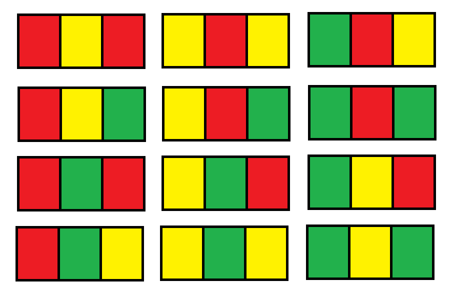
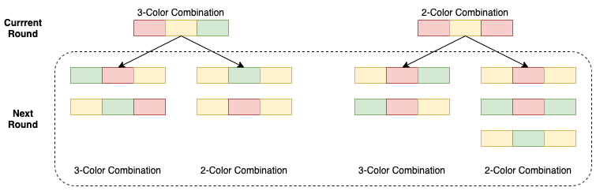

## 1411. Number of Ways to Paint N × 3 Grid (Hard)

> 難度：**Hard**
> 題目連結：[LeetCode](https://leetcode.com/problems/number-of-ways-to-paint-n-3-grid/)

---

### 📌 題目資訊

- **題號**：1411
- **題名**：Number of Ways to Paint N × 3 Grid
- **難度**：Hard
- **題型**：Dynamic Programming / State Compression / Combinatorics

---

### 🧠 題意說明（Description）

給定一個大小為 `n × 3` 的 grid，每個格子可以塗上 **紅、黃、綠** 三種顏色之一，
且必須滿足以下條件：

- 上下相鄰格子 **不可同色**
- 左右相鄰格子 **不可同色**

請計算在給定 `n` 的情況下，有多少種合法的塗色方式。
答案需對 `10^9 + 7` 取模。

---

### 💡 關鍵觀察（Key Idea / Observation）

對於 **每一列（1 × 3）** 的塗色方式，其實只會出現 **兩種結構型態**：

1. **Case A：三色互異（3-color combination）**
   - 例如：`RGB`, `YGR`, `BRY`
2. **Case B：兩色夾一（2-color combination）**
   - 例如：`RGR`, `YBY`, `GBG`

在 `n = 1` 時：



- Case A：6 種
- Case B：6 種

---

### 🖼 狀態轉移直覺圖



---

### 🧠 狀態轉移分析（DP Transition）

令：
- `caseA`：目前層為 **三色互異** 的塗法數量
- `caseB`：目前層為 **兩色夾一** 的塗法數量

經由合法顏色搭配與上下相鄰限制，可以推導出：

- **new_caseA**
  - 由上一層的 Case A 產生：`2 × caseA`
  - 由上一層的 Case B 產生：`2 × caseB`

- **new_caseB**
  - 由上一層的 Case A 產生：`2 × caseA`
  - 由上一層的 Case B 產生：`3 × caseB`

因此狀態轉移為：

new_caseA = 2 * caseA + 2 * caseB
new_caseB = 2 * caseA + 3 * caseB

---

### 🛠 解法思路（Approach）

1. 初始化：
   - `caseA = 6`
   - `caseB = 6`
2. 從第 2 列開始，重複進行狀態轉移
3. 每一輪只保留目前狀態（空間最佳化）
4. 最後答案為 `caseA + caseB`

---

### ⏱ 時間與空間複雜度（Complexity Analysis）

- **Time Complexity**：`O(n)`
- **Space Complexity**：`O(1)`
- 僅使用常數個變數
- 不需額外 DP table

---

### ⚙️ C++ 解法

```cpp
class Solution {
public:
    int numOfWays(int n) {
        const int MOD = 1000000007;
        long long caseA = 6, caseB = 6;

        for (int i = 1; i < n; i++) {
            long long new_caseA = (caseA * 2 + caseB * 2) % MOD;
            long long new_caseB = (caseA * 2 + caseB * 3) % MOD;
            caseA = new_caseA;
            caseB = new_caseB;
        }

        return (caseA + caseB) % MOD;
    }
};
```

---

## 🐍 Python 解法

```python
class Solution:

```

## 個人學習紀錄

| 成員 | 首次完成 | 最近複習 | 熟悉度 | 個人筆記 |
|---|:---:|:---:|:---:|---|
| GitHub ID | YYYY-MM-DD | YYYY-MM-DD | 1～5 | 容易忘記的觀念、下次複習重點或個人解法連結 |
