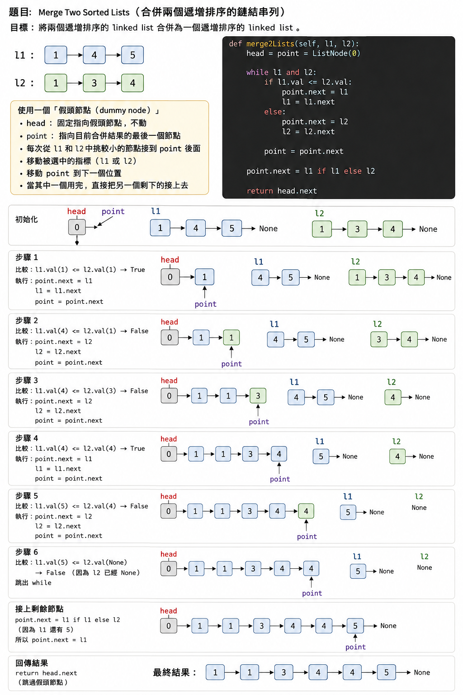

# 23. Merge k Sorted Lists

> 難度：**Hard**
> 題型：`Linked List`, `Divide and Conquer`
> 題目連結：[LeetCode](https://leetcode.com/problems/merge-k-sorted-lists/)

## 題目摘要

給定 k 個已經由小到大排序的 Linked List，需要將它們合併成一條同樣由小到大排序的 Linked List。

可以先解決「如何合併兩條 Linked List」，再透過兩兩合併的方式，逐步將 k 條 Linked List 合併成一條。

## 解題思路

### 關鍵觀察

- 兩條已排序的 Linked List，可以使用兩個 pointer 比較目前節點的值，每次將較小的節點接到結果後方。這就是 merge2Lists()。
- 如果直接依序將第 1、2、3...條 Linked List 合併，前面的 Linked List 會越來越長，效率較差。因此採用 Divide and Conquer，先兩兩合併，再將合併後的結果繼續兩兩合併。
- 使用 `interval` 控制每一輪要合併的 Linked List 間距：

  - `interval` = 1：合併 (0,1)、(2,3)、(4,5)...
  - `interval` = 2：合併 (0,2)、(4,6)...
  - `interval` = 4：合併 (0,4)...
    - 每輪 `interval` *= 2，直到所有 Linked List 合併完成。
- 如果某一輪有 Linked List 沒有配對到，例如總共有 3 條，剩下的那一條直接保留到下一輪再進行合併。

### 演算法

1. 實作 `merge2Lists(l1, l2)`: 建立 dummy node head，並使用 point 指向目前結果的尾端。
比較 l1.val 和 l2.val。
將較小的節點接到 point.next。
被選中的 Linked List pointer 往下一個節點移動。
point 也往下一個節點移動。
其中一條 Linked List 用完後，直接將另一條剩餘部分接到 point.next。


2. 在 mergeKLists() 中設定：

   ```python
   interval = 1
   ```

   第一輪將相鄰的 Linked List 兩兩合併：

   ```text
   A   B   C   D
    \ /          \ /
    AB      CD
   ```

3. 每完成一輪：

   ```python
   interval *= 2
   ```

   下一輪再合併上一輪的結果：

   ```text
      AB      CD
        \          /
         ABCD
   ```

   重複直到 `interval >= amount`，此時 `lists[0]` 就是所有 Linked List 的合併結果。

### 三條 Linked List 的情況

如果只有三條 Linked List：

```text
A   B   C
 \   /
  AB     C
    \      /
     ABC
```

第一輪只有 `A` 和 `B` 合併，`C` 沒有配對到，所以先保留。

下一輪再將 `AB` 和 `C` 合併。

因此不需要特別處理奇數個 Linked List。

## 複雜度

- 時間：`O(Nlogk)`: where k is the number of linked lists.
  - `N` 是所有 Linked List 的節點總數
  - 每一輪合併總共會處理約 `N` 個節點
  - 每輪將 Linked List 數量大約減半，因此共有 `log k` 輪
  - 總時間複雜度為 `O(N log k)`

- 空間：`O(1)` We can merge two sorted linked lists in O(1) space.
  - `merge2Lists()` 直接修改原本節點的 `next` pointer
  - 沒有建立與輸入大小成比例的新 Linked List
  - 使用 iterative merge，因此也沒有 recursion stack

## Python

```python
# Definition for singly-linked list.
# class ListNode:
#     def __init__(self, val=0, next=None):
#         self.val = val
#         self.next = next
class Solution:
    def mergeKLists(self, lists: List[Optional[ListNode]]) -> Optional[ListNode]:
        amount = len(lists)
        interval = 1
        while interval < amount:
            for i in range(0, amount - interval, interval * 2):
                lists[i] = self.merge2Lists(lists[i], lists[i + interval])
            interval *= 2
        return lists[0] if amount > 0 else None

    def merge2Lists(self, l1, l2):
        head = point = ListNode(0)
        while l1 and l2:
            if l1.val <= l2.val:
                point.next = l1
                l1 = l1.next
            else:
                point.next = l2
                l2 = l2.next
            point = point.next
        if l1:
            point.next = l1
        else:
            point.next = l2
        return head.next
```

## C++

```cpp
class Solution {
public:
    // TODO: implement
};
```

## 邊界條件與筆記


## 討論與補充
- Divide and Conquer 跟 Dynamic programing 與什麼差啊?

## Divide and Conquer vs Dynamic Programming

Divide and Conquer（分治法）和 Dynamic Programming（動態規劃，DP）都會：

> 將大問題拆成小問題 → 解決小問題 → 得到大問題的答案。

最核心的差異是：

> **子問題是否會重複出現（Overlapping Subproblems）。**

| | Divide and Conquer | Dynamic Programming |
|---|---|---|
| 中文 | 分治法 | 動態規劃 |
| 核心 | 拆成彼此獨立的子問題 | 拆成會重複出現的子問題 |
| 子問題 | 通常不重疊 | 大量重疊 |
| 儲存計算結果 | 通常不需要 | 通常需要 |
| 常見方法 | Recursion、Merge | Memoization、DP Table |
| 經典題目 | Merge Sort、Quick Sort、Merge K Sorted Lists | Fibonacci、Knapsack、LCS |

---

## Divide and Conquer

Divide and Conquer 的核心：

1. **Divide**：將大問題拆成數個較小的問題。
2. **Conquer**：分別解決這些小問題。
3. **Combine**：將小問題的結果組合成最終答案。

例如 Merge Sort：

```text
              [8 3 5 1]
               /     \
              /       \
           [8 3]     [5 1]
           /  \       /  \
         [8]  [3]   [5]  [1]
```

每個子問題基本上都是不同的：

```text
[8 3] 和 [5 1]
```

不會一直重新計算同一個問題，因此通常不需要額外儲存子問題的答案。

### Merge K Sorted Lists

LeetCode 23 的做法也是 Divide and Conquer：

```text
A     B     C     D
 \   /       \   /
  AB          CD
    \        /
     \      /
      ABCD
```

例如：

```text
interval = 1

A     B     C     D
 \   /       \   /
  AB          CD


interval = 2

     AB      CD
       \    /
        ABCD
```

每次將問題規模縮小一半，因此大約需要：

```text
log₂(k)
```

層。

---

## Dynamic Programming

Dynamic Programming 的重要特徵之一是：

> **Overlapping Subproblems（重疊子問題）**

也就是相同的小問題會被重複計算。

例如 Fibonacci：

```python
def fib(n):
    if n <= 1:
        return n

    return fib(n - 1) + fib(n - 2)
```

計算 `fib(5)`：

```text
                    fib(5)
                   /      \
              fib(4)      fib(3)
              /   \        /   \
         fib(3) fib(2) fib(2) fib(1)
          / \
     fib(2) fib(1)
```

可以看到：

```text
fib(3) → 重複出現
fib(2) → 重複出現很多次
```

因此會浪費大量計算。

DP 的想法是：

> **算過的結果存起來，下次遇到相同問題直接使用。**

例如 Memoization：

```python
memo = {}

def fib(n):
    if n <= 1:
        return n

    if n in memo:
        return memo[n]

    memo[n] = fib(n - 1) + fib(n - 2)

    return memo[n]
```

第一次：

```text
fib(3)
  ↓
算出答案 2
  ↓
memo[3] = 2
```

下一次：

```text
fib(3)
  ↓
發現 memo[3]
  ↓
直接 return 2
```

不需要重新計算。


### Dynamic Programming

```text
              Problem
              /     \
             A       B
            / \     / \
           C   D   D   E
               ↑   ↑
              重複
```

`D` 重複出現。

因此：

```text
第一次算 D
    ↓
儲存答案
    ↓
第二次遇到 D
    ↓
直接使用答案
```

---

## DP 的兩個重要特徵

### 1. Overlapping Subproblems

相同的子問題會重複出現。

例如：

```text
fib(5)
 → fib(4)
 → fib(3)
 → fib(2)

很多 fib(n) 會重複計算
```

因此適合將結果儲存在：

```python
memo[n]
```

或：

```python
dp[n]
```

---

### 2. Optimal Substructure

大問題的最佳解，可以透過較小問題的最佳解組合得到。

例如：

```text
容量 10 的背包最佳解

可能依賴：

容量 9 的最佳解
容量 7 的最佳解
容量 5 的最佳解
...
```

因此可以定義：

```python
dp[i][capacity]
```

來記錄某個狀態的最佳答案。

---

## DP 不等於 Iteration

需要注意：

> **Divide and Conquer 和 DP 的差別不是 Recursion vs Iteration。**

DP 本身也可以使用 Recursion。

### Top-down DP

Recursion + Memoization：

```python
@cache
def dp(i):
    ...
```

流程：

```text
大問題
 ↓
Recursive 拆小問題
 ↓
算過的結果存起來
```

### Bottom-up DP

使用 DP Table：

```python
dp = [...]

for i in range(...):
    ...
```

流程：

```text
最小問題
 ↓
逐步計算
 ↓
建立較大的答案
 ↓
最終答案
```

---

## 如何判斷？

刷 LeetCode 時可以先這樣判斷：

```text
看到「拆成左右兩半」
        ↓
優先考慮
Divide and Conquer

例如：
- Merge Sort
- Quick Sort
- Merge K Sorted Lists
```

如果：

```text
看到「同樣的 state 一直重新計算」
        ↓
優先考慮
Dynamic Programming

例如：
- Fibonacci
- Climbing Stairs
- Knapsack
- Longest Common Subsequence
```

---

## 一句話記憶

```text
Divide and Conquer
= 拆成「不同」的小問題，各自解決後合併。

Dynamic Programming
= 拆成「會重複」的小問題，把算過的答案存起來重複利用。
```

因此 LeetCode 23：

```text
Merge K Sorted Lists
        ↓
兩兩合併
        ↓
每輪問題數量約減半
        ↓
子問題沒有重複計算
        ↓
Divide and Conquer
```
> 歡迎提出疑問、替代解法、最佳化方向或勘誤；個人進度請記錄在自己的 `progress/<GitHub ID>.md`。

<!--
### @GitHub-ID — YYYY-MM-DD

- 類型：疑問 / 替代解法 / 最佳化 / 勘誤
- 內容：請具體描述想法或問題。
-->
